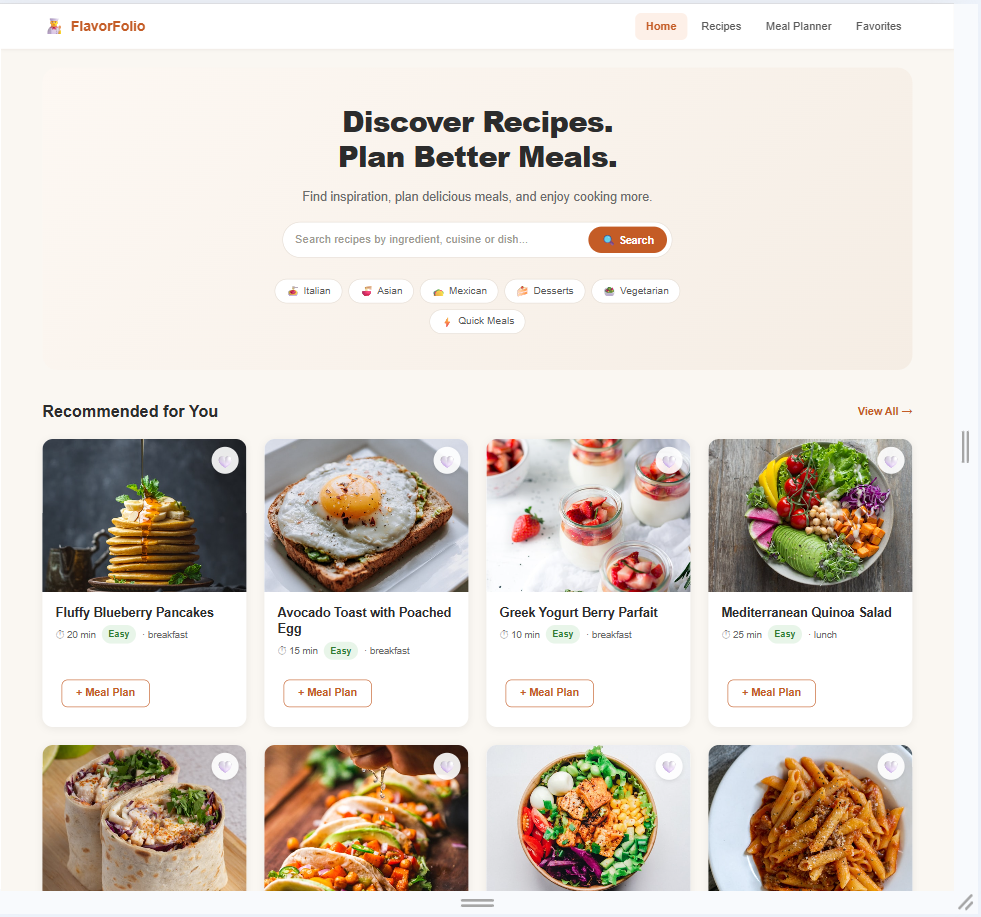
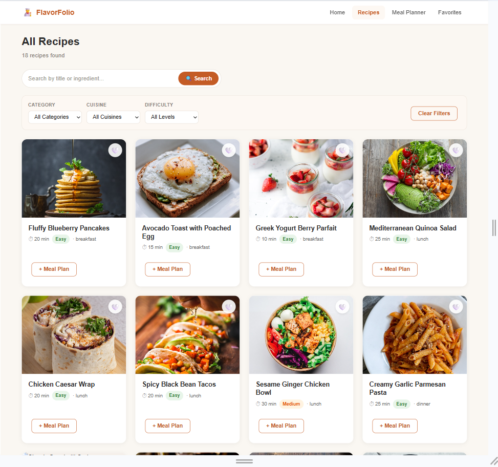
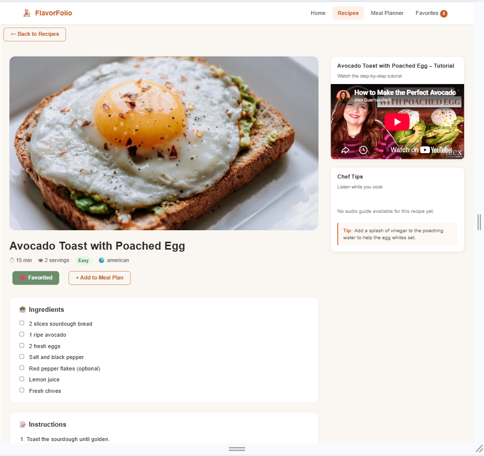
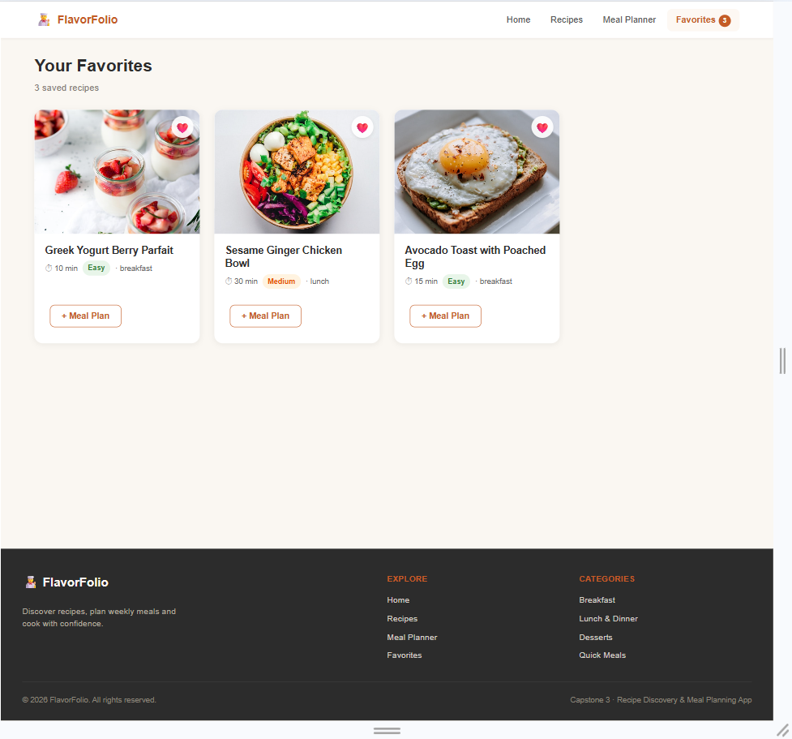
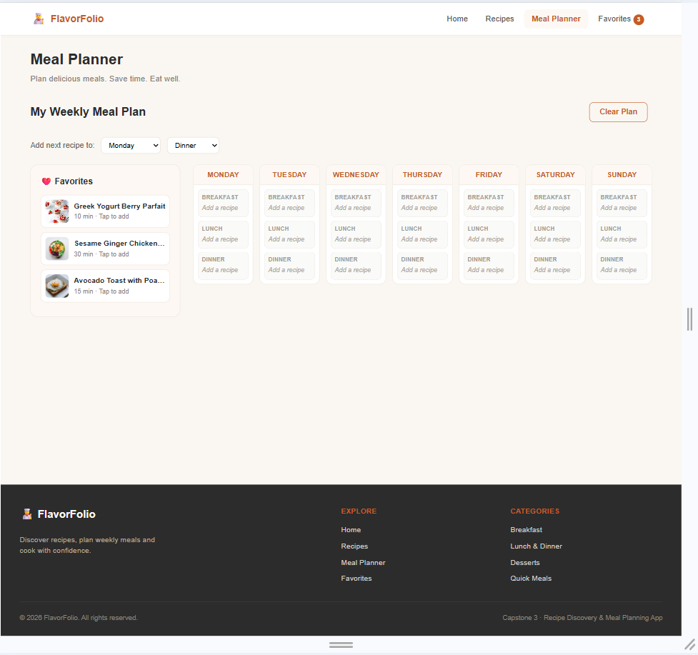

[](https://classroom.github.com/online_ide?assignment_repo_id=24322030&assignment_repo_type=AssignmentRepo)
# Recipe Hub – Recipe Discovery & Meal Planning App

A modern, responsive React application built for a local cooking school partnered with food bloggers. Users can browse and search recipes, view detailed instructions with video & audio guides, mark favorites, and plan weekly meals.

## Features

- Browse & search recipes by title, ingredient, category, cuisine or difficulty
- Recipe detail pages with ingredients checklist, step-by-step instructions
- Embedded HTML5 video tutorials and audio chef-tips
- Favorites system with localStorage persistence
- Weekly meal planner (Mon–Sun × breakfast/lunch/dinner) with localStorage
- Fully responsive design (mobile, tablet, desktop)
- React Router with active link styling and 404 page
- Professional UI with CSS Modules, hover effects and smooth transitions

## Screenshots

### 1. Home


### 2. Recipes


### 3. Recipe Details


### 3. Favorites


### 4. Meal Plan


## Technologies

- React 18 (functional components + hooks only)
- React Router DOM v6
- PropTypes for runtime type checking
- CSS Modules + inline styles + conditional classes
- Vite for fast development & builds
- localStorage for client-side persistence

## Getting Started

```bash
# Install dependencies
npm install

# Start development server
npm run dev

# Production build
npm run build
```

Open the URL shown in the terminal (usually http://localhost:5173).

NB: Add recipe to favorites first before you can add to the meal plan. 

## Project Structure

```
src/
├── components/
│   ├── common/          # Header, Footer
│   ├── Navigation/      # Navbar (sticky, responsive, active routes)
│   ├── UI/              # Button, Card, SearchBar, Loading, Modal
│   ├── Recipe/          # RecipeCard, RecipeList, RecipeDetail, RecipeFilter
│   ├── MealPlanner/     # MealPlanner, DayCard
│   └── Media/           # VideoPlayer, AudioPlayer
├── pages/               # Home, RecipesPage, MealPlannerPage, FavoritesPage, NotFound
├── data/                # recipesData.js (18 sample recipes)
├── App.jsx              # Root – state, routing, localStorage
└── main.jsx
```

## Project Plan

### 1. Component Hierarchy

`App` (root) owns shared state and routing. It renders `Navbar`, `Routes`, and `Footer`. Pages nest feature components, which further nest reusable UI pieces.

### 2. Data Flow

State is lifted to `App.jsx`. Data flows down as props, while events flow up via callback props. Sibling components such as `RecipeList` and `FavoritesPage` communicate through the shared parent state.

### 3. Components List

- **Navigation:** `Navbar`
- **Recipe:** `RecipeCard`, `RecipeList`, `RecipeDetail`, `RecipeFilter`
- **Meal Planner:** `MealPlanner`, `DayCard`
- **Media:** `VideoPlayer`, `AudioPlayer`
- **Reusable UI:** `Button`, `Card`, `SearchBar`, `Loading`, `Modal`
- **Pages:** `Home`, `RecipesPage`, `MealPlannerPage`, `FavoritesPage`, `NotFound`
- **Common:** `Header`, `Footer`
- **Data:** `recipesData.js`

### 4. Props Flow

- `RecipeCard` receives `recipe` (object), `isFavorite` (boolean), `onFavoriteToggle` (function), and `onAddToPlan` (function).
- `RecipeList` receives `recipes[]`, `favorites[]`, `onFavoriteToggle`, and `onSelect`.
- `DayCard` receives `day` (string), `meals` (object), and `onRemoveMeal` (function).
- `Button` receives `variant`, `children`, `onClick`, and `disabled` (with default parameters used).
- `Card` and `Modal` use the `children` prop for composition.
- Expressions are used as props, for example:
  - `className={isFavorite ? styles.active : ''}`
  - `style={{ opacity: loading ? 0.5 : 1 }}`

### 5. State Management Strategy

- **Lifted state in `App.jsx`:** `favorites` (array), `mealPlan` (object with Mon–Sun slots), and `recipes` (array loaded once).
- **Local state:** `searchTerm`, `selectedCategory`, `selectedCuisine`, `isLoading`, and `showModal` are held in the relevant page/filter components.
- **`useEffect` hooks:** 
  1. Load `recipesData` on mount.
  2. Hydrate `favorites` and `mealPlan` from `localStorage` on mount.
  3. Persist `favorites` and `mealPlan` whenever they change.
- **Persistence:** `localStorage` keys are `favorites` and `mealPlan`. `JSON.stringify` / `JSON.parse` are used with safe fallbacks.
- **Updates:** Immutable patterns only — spread arrays/objects are used instead of direct mutation. This ensures correct re-renders and clean communication between sibling components.

## Routes

| Path              | Component          |
|-------------------|--------------------|
| `/`               | Home               |
| `/recipes`        | RecipesPage        |
| `/recipes/:id`    | RecipeDetail       |
| `/meal-planner`   | MealPlannerPage    |
| `/favorites`      | FavoritesPage      |
| `*`               | NotFound (404)     |

## Sample Data

18 recipes covering:
- Breakfast (3), Lunch (4), Dinner (5), Dessert (3), Snacks (3)
- Video of the recipe might not be the exact same recipe writtent but for the purposes of this assignment I used a close match of a similar recipe from YouTube

## Future Enhancements

- Real video/audio assets
- Drag-and-drop meal planner
- User accounts & cloud sync
- Grocery list generator
- Nutritional information

---

